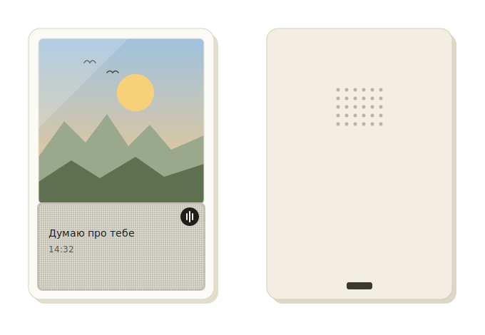

# Smart Polaroid

Розумний пристрій у форм-факторі Polaroid-фото: приймає голосові повідомлення через Telegram, показує текст і статуси на E-Ink дисплеї, реагує на дотик кольоровою підсвіткою та працює автономно від акумулятора.



*Зліва — вигляд спереду: класична форма Polaroid-фото з ілюстрацією пейзажу зверху, де нижня біла смуга — це монохромний E-Ink дисплей із текстовим повідомленням та значком нового голосового. Справа — вигляд ззаду: отвори динаміка та слот Type-C для заряджання.*

## Технології

**Прошивка**
- C++ / Arduino framework
- ESP32-S3 (WROOM-1)
- PlatformIO + Wokwi Simulator (розробка та тестування без фізичного заліза)

**Периферія**
- Wi-Fi (esp_wifi / WiFi.h)
- I2C — OLED SSD1306 (симуляція) → E-Ink GxEPD2 (залізо)
- WS2812B — адресна RGB-підсвітка (FastLED)
- I2S — аудіо через MAX98357A
- SD-картка (SPI) — локальний кеш аудіофайлів
- Deep Sleep — автономне живлення від Li-Po

**Бекенд**
- Python (python-telegram-bot)
- FFmpeg — конвертація голосових повідомлень (OGG/Opus → MP3)
- UniversalTelegramBot + ArduinoJson — інтеграція бота з прошивкою

**Корпус**
- Fusion 360 — 3D-модель у форм-факторі Polaroid (88 × 107 мм)

## Як це працює

1. Голосове повідомлення надсилається боту в Telegram.
2. Проміжний сервер (Python) приймає файл і конвертує його у MP3.
3. Пристрій опитує сервер, завантажує готовий файл на SD-картку та відтворює його.
4. Статус і текст відображаються на E-Ink екрані; підсвітка сигналізує про стан.
5. Між подіями пристрій перебуває в deep sleep для економії заряду.

## Розробка

Проєкт побудований інкрементально — кожна фаза додає рівно один новий компонент (Wi-Fi → екран → підсвітка → кнопка → бот → аудіо → перехід на реальне залізо), і перевіряється в симуляторі Wokwi, перш ніж переходити далі.

```bash
# Збірка та симуляція (VS Code + PlatformIO + Wokwi extension)
PlatformIO: Build
Wokwi: Start Simulator
```

## Статус

Проєкт у розробці. Поточний прогрес фіксується в цьому репозиторії по мірі проходження фаз.